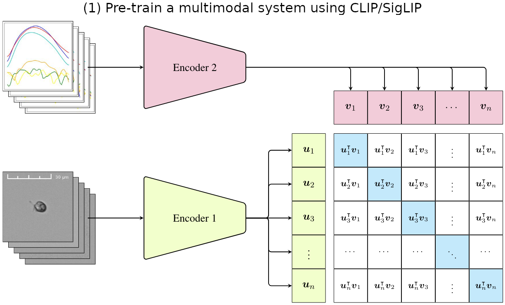
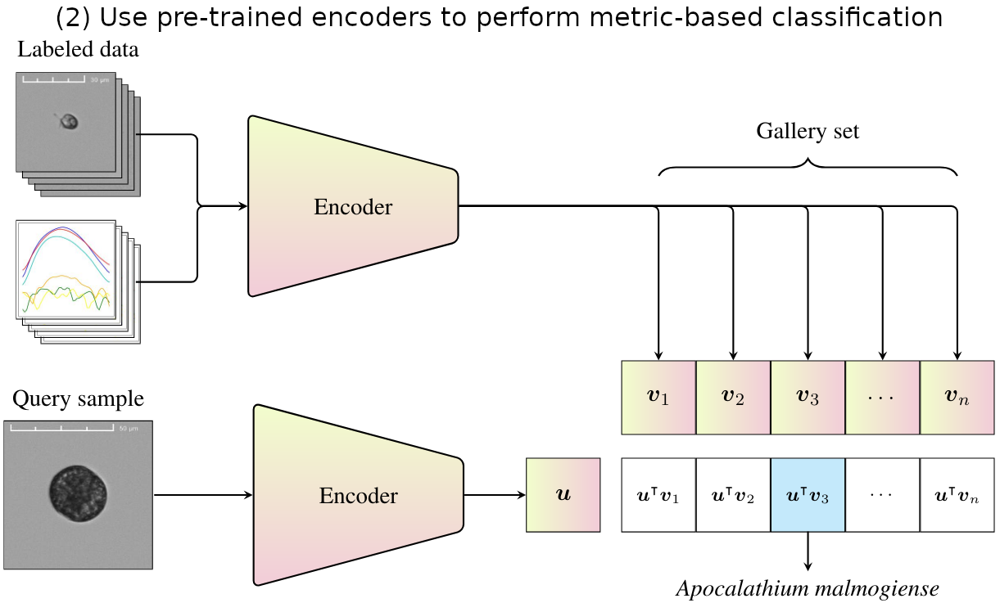
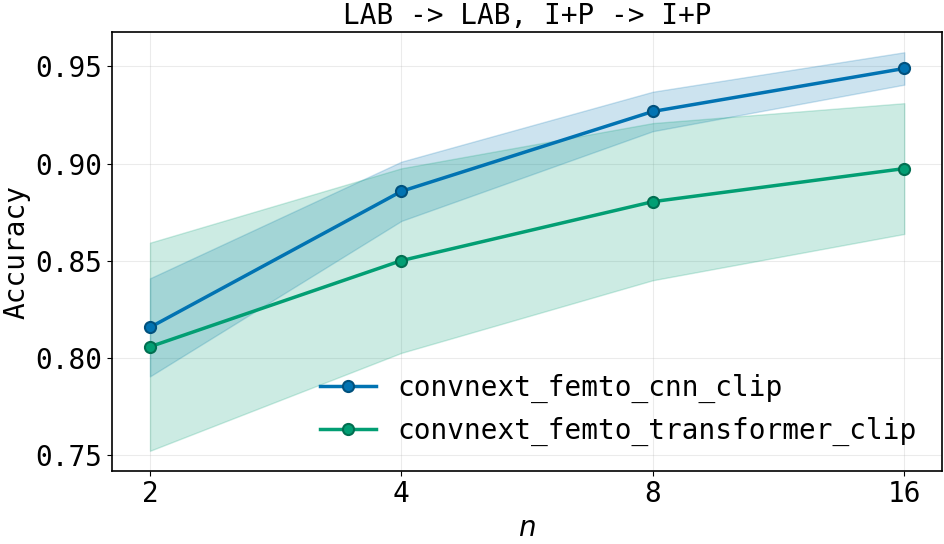

# Cross-modal learning for plankton recognition

Code and models for the paper: "Cross-modal learning for plankton recognition"

The project focuses on joint image-signal representation learning for plankton recognition using CLIP-style contrastive pre-training. 

Pre-training           |  Inference
:-------------------------:|:-------------------------:
 | 

The code was built using 
```
Python 3.12.3
PyTorch 2.5.1
CUDA 13.0
```

# Usage
To install the exact environment used to produce the results shown in paper run:
```
pip install -r requirements-lock.txt
pip install -e . --no-deps
```
or to install in editable mode with newer compatible versions of the packages:
```
pip install -e .
```

The editable mode puts the project to `PYTHONPATH` and fixes imports from `src`.

## Downloading the datasets

The datasets can be downloaded from here [https://doi.org/10.23729/fd-470acabc-afb8-39cb-a86e-0f81872e7443](https://doi.org/10.23729/fd-470acabc-afb8-39cb-a86e-0f81872e7443). After downloading, move each dataset folder into the data/ directory so the structure looks like: 
```
data/
├── LAB/
├── SEA/
└── UTO/
```

### Splitting the datasets
The datasets splitting is handled by the `split_kfold.py` script. The script supports two different splitting modes, depending on your use case.

1. K-fold splitting (training and testing with same dataset)
Divides the dataset is into `k` folds, and for each fold:
- 80% of the data is used for training
- 5% for validation
- 15% for testing

Example command:  
```
python ./scripts/split_kfold.py --mode kfold --dataset data/LAB --k 5
```

2. Single train/validation split (training only)
The dataset is split into:
- 95% for training
- 5% for validation
This mode is intended for unlabeled datasets if one wants to track separate metrics during training or for selecting the best model.

Example command:
```
python ./scripts/split_kfold.py --mode single --dataset ./data/UTO
```

## Training models
Model architectures and training settings are defined using model cards in `configs/train/[multi/dino]`

Model card specifies:
- Image encoder (e.g. ConvNeXt, ViT, EfficientNet)
- Profile encoder
- Projection heads
- Training hyperparameters
- Loss configuration

### Cross-modal training
Image and profile encoders can be jointly trained using:
```
python scripts/train_multi.py --config configs/train/multi/your_model.yaml -d data/<DATASET>
```
or if training multiple models via shell scripts
```
bash scripts/train_multi.sh
```
The checkpoints and logs are written to `logs/<experiment_name>` and can be analyzed in tensorboard by running `tensorboard --logdir=logs`.

### Image-only training
To train an image-only self-supervised baseline run:
```
python scripts/train_dino.py --config configs/train/dino/your_model.yaml -d data/<DATASET>
```
or
```
bash scripts/train_dino.sh
```

The DINO implementation uses `LightlySSL` python package of which more information can be found from here [Lightly Github](https://github.com/lightly-ai/lightly)


## Extracting embeddings
After training, embeddings need to be extracted for evaluation.

This also follows similar setup from training, so first define an experiment `configs/experiment/experiment.yaml`.

This file specifies:
- Which trained models to use
- Which dataset to run on
- Image size, batch size, number of workers for dataloader
- Where to save embeddings

Afterwards extract embeddings by running:
```
python scripts/extract_embeddings.py
```

This saves the embeddings to `results/embeddings/` as `.pkl`.

### Benchmarking (kNN evaluation)
To evaluate embeddings using kNN:
```
python scripts/run_benchmark.py
```
The benchmark:

- Samples gallery sets of varying size per class
- Evaluates image-only, profile-only, and combined representations
- Supports multiple values of k
- Selects gallery set multiple times for robustness

This saves the results to `results/benchmarks/` as `.pkl`.

### Analyzing results
The results can be analyzed in the provided jupyter notebook `analyze_results.ipynb`. The notebook provides accuracies for all setups and also allows plotting the accuracy over the gallery set size.


